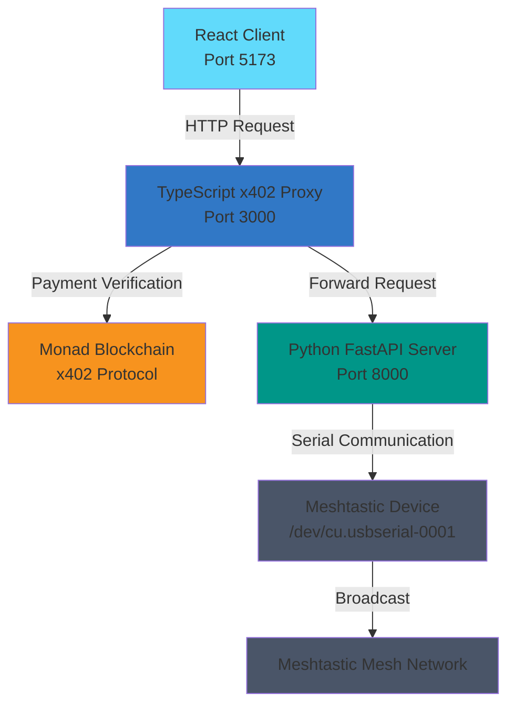

# FALLBACKAI

A decentralized messaging system that enables broadcasting messages over Meshtastic mesh networks with blockchain-based payment processing via the x402 protocol on Monad blockchain.

## Overview

**FALLBACKAI** is a full-stack application that provides a REST API interface to broadcast messages over Meshtastic mesh networks. The system includes optional blockchain-based payment processing, allowing you to monetize message broadcasting while maintaining free access to health checks and monitoring endpoints.

### Architecture



### Components

- **Python FastAPI Server** (`server/`): Core Meshtastic broadcasting functionality with persistent serial connection
- **TypeScript x402 Proxy** (`proxy/`): Payment gateway wrapper using thirdweb x402 protocol on Monad blockchain
- **React Client Application** (`client/`): Web interface for broadcasting messages with automatic payment handling

## Prerequisites

### Server Requirements
- Python 3.10
- `uv` package manager ([install guide](https://github.com/astral-sh/uv))
- Meshtastic device connected to `/dev/cu.usbserial-0001` (or configure your serial port)

### Proxy Requirements
- Node.js 18+ (for native fetch support)
- npm or yarn
- Thirdweb account with secret key
- Monad wallet address for receiving payments

### Client Requirements
- Node.js 18+
- npm or yarn
- Thirdweb Client ID

## Quick Start

For detailed setup and usage instructions, see the [Quick Start Guide](QUICKSTART.md).

**TL;DR:**
1. **Server**: `cd server && uv sync && uv run uvicorn main:app --host 0.0.0.0 --port 8000`
2. **Proxy** (optional): `cd proxy && npm install && npm run dev`
3. **Client**: `cd client && npm install && npm run dev`

## API Endpoints

### Server Endpoints (Direct Access)

- `POST /broadcast` - Broadcast a message over Meshtastic network
- `GET /health` - Check server and Meshtastic connection status

### Proxy Endpoints (With Payment)

- `POST /broadcast` - **Protected** - Requires x402 payment ($0.01)
- `GET /health` - **Free** - Health check (proxied to FastAPI)
- All other endpoints - **Free** - Proxied to FastAPI

## Configuration

### Server Configuration

- **Serial Port**: Default is `/dev/cu.usbserial-0001` (macOS). Update in `server/main.py` for your system
- **Port**: Default is `8000`. Change with `--port` flag when starting uvicorn

### Proxy Configuration

See [proxy/README.md](proxy/README.md) for detailed configuration options.

### Client Configuration

- **Proxy URL**: Default is `http://localhost:3000`. Update `VITE_PROXY_URL` in `.env` if different
- **Thirdweb Client ID**: Required. Get from [thirdweb dashboard](https://thirdweb.com/dashboard)

## Blockchain Configuration

- **Network**: Monad Mainnet
- **Chain ID**: 10143
- **RPC URL**: `https://rpc.monad.xyz`
- **Payment**: $0.01 per broadcast (configurable)

## Project Structure

```
FALLBACKAI/
├── server/          # Python FastAPI server
│   ├── main.py      # FastAPI application
│   └── pyproject.toml
├── proxy/           # TypeScript x402 payment proxy
│   ├── src/         # TypeScript source files
│   └── package.json
├── client/          # React web application
│   ├── src/         # React source files
│   └── package.json
└── README.md        # This file
```


## Documentation

- **[Quick Start Guide](QUICKSTART.md)** - Get up and running quickly
- [Server Documentation](server/README.md)
- [Proxy Documentation](proxy/README.md)
- [Client Documentation](client/README.md)
- [Thirdweb x402 Documentation](https://portal.thirdweb.com/x402/client)
- [Meshtastic Documentation](https://meshtastic.org/docs/)

## License

MIT

## Notes

- The Meshtastic connection is established when the server starts and remains open until shutdown
- Ensure your Meshtastic device is properly connected and configured before starting the server
- Payments are processed on the Monad blockchain using the x402 protocol
- Health check endpoints are always free and don't require wallet connection
- For production deployments, consider using environment-specific configurations and proper security measures

